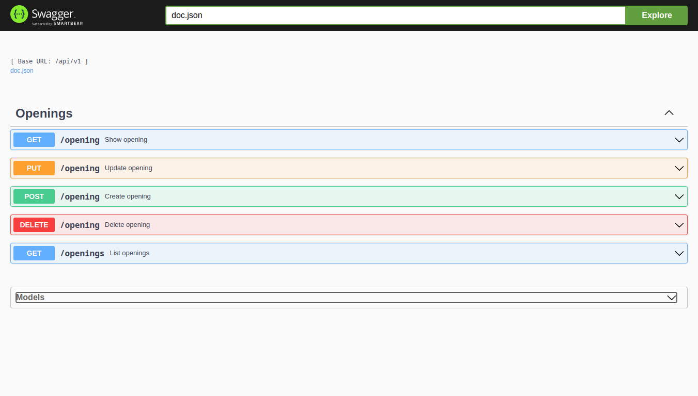

<h1 align="center"> <strong>🏢 Find Opportunities</strong></h1>

<p align="center">


</p>

<br />

# 📕 About

This project is a modern job opportunities API built using Golang, currently one of the highest paying programming languages. The API is powered by Go-Gin as a router, GoORM for database communication, SQLite as the database, and Swagger for API documentation and testing. The project follows a modern package structure to keep the codebase organized and maintainable.

</br>
<p align="center" >

  
 
</p>

# 🛠️Technologies:
This project was made using the follow technologies:

[](https://skillicons.dev)


### Tools
- [Go-Gin](https://github.com/gin-gonic/gin)
- [GoORM ](https://gorm.io/)

# 🚀Features
* Implementing a complete job opportunities API with endpoints for searching, creating, editing, and deleting opportunities
* Using Go-Gin as a router for route management
* Implementing SQLite as the database for the API
* Using GoORM for communication with the database
* Integrating Swagger for API documentation and testing


# 🏃Getting Started

```sh
#  Clone Repository
$ git clone https://github.com/wesleywcr/find-opportunities.git

# Install Dependencies
$ go mod download

# Docker and Docker Compose
$ docker compose up
$ docker compose start

# Build the application
$ go build

# Run the application
$ go run main.go
```
## Makefile
The project includes a Makefile to help you manage common tasks more easily.

```sh
#  Clone Repository
$ make run

```


# Usage
After the API is running, you can use the Swagger UI to interact with the endpoints for searching, creating, editing, and deleting job opportunities. The API can be accessed at http://localhost:$PORT/swagger/index.html.

Default $PORT if not provided=8080.

# 🤝 Contributing

- Fork this repository
- Create a branch with your feature: `git checkout -b my-feature`
- Commit your changes: `git commit -m 'feat: My new feature'`
- Push your branch: `git push origin my-feature`
# 

Released in 2024.
Made with ❤️ by [Wesley Rodrigues](https://github.com/wesleywcr)🤙👊
